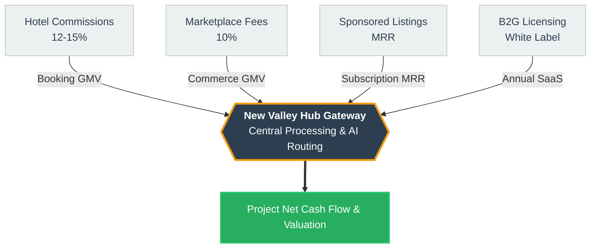

# Feasibility & Engineering Economics Report
**Project:** New Valley Hub  
**Prepared by:** SandScript Team  
**Date:** April 2026

---

## 1. Executive Summary

The **New Valley Hub** represents a strategic, high-yield digital infrastructure project aimed at transforming the eco-tourism ecosystem of Al Wadi Al Jadid (New Valley), Egypt. Structured similarly to a smart infrastructure system (e.g., a "Smart Garage" controlling throughput and value extraction), this platform centralizes diverse services—accommodation, local crafts, and AI-guided tours—into a unified digital gateway. By addressing severe market inefficiencies and bridging the digital divide, we unlock a sustainable and scalable revenue model with minimal initial capital expenditure and incredibly high margins. This report details the technical feasibility, economic viability, and precise cash flow structures validating the project's long-term profitability.

---

## 2. Problem Statement & Opportunity

**The Economic Problem:**
Al Wadi Al Jadid contains unparalleled historical and natural assets, yet remains economically isolated due to a severe infrastructure and digital divide.
- **Economic Isolation of Artisans:** Local craftsmen and small merchants depend entirely on negligible physical foot traffic, severing them from a multi-million-dollar national souvenir and craft market.
- **Data & Information Scarcity:** Potential tourists face friction at every step—from navigating untracked desert routes to booking non-digitized eco-lodges.
- **Fragmented Yield Management:** The absence of a unified booking directory means massive lost revenue for both hospitality vendors and municipal oversight.

**The Strategic Opportunity:**
By deploying a centralized digital hub, we inject immediate liquidity into the local ecosystem. We act as the primary intermediary for all transactions, capturing value at multiple touchpoints while drastically reducing the customer acquisition cost (CAC) for local vendors.

---

## 3. Revenue Streams & Model

Our economic model relies on a diversified, low-marginal-cost revenue architecture. Similar to a toll-booth model in infrastructure economics, New Valley Hub captures value from throughput across its ecosystem.

1. **Hotel Commissions (12-15%):** Primary volume driver. We take a commission on every room night booked through our API integrations.
2. **Marketplace Fees (10%):** A direct transactional cut on the gross merchandise value (GMV) of local crafts and dates sold.
3. **Sponsored Listings:** Predictable monthly recurring revenue (MRR) from local businesses prioritizing their placement on the platform.
4. **B2G Licensing (White Label):** High-ticket, high-margin software licensing to municipal governments and tourism boards utilizing our data dashboards.

---

## 4. Detailed Cash Flow Analysis (Year 1)

The first year (Months 1 - 12) is focused on platform deployment, vendor onboarding, and initial market penetration. Our capital expenditure is heavily subsidized by the initial grant, leading to immediately positive aggregate cash flow.

### Year 1 Cash Flow Statement (in EGP)

| Cash Inflows (Revenues) | M 1 | M 2 | M 3 | M 4 | M 5 | M 6 | M 7 | M 8 | M 9 | M 10 | M 11 | M 12 | Total Year 1 |
| :--- | :--- | :--- | :--- | :--- | :--- | :--- | :--- | :--- | :--- | :--- | :--- | :--- | :--- |
| **Grant Funding (Prize)** | 200,000 | 0 | 0 | 0 | 0 | 0 | 0 | 0 | 0 | 0 | 0 | 0 | **200,000** |
| **Hotel Commissions** | 0 | 0 | 0 | 15,000 | 35,000 | 65,000 | 100,000 | 150,000 | 220,000 | 300,000 | 350,000 | 400,000 | **1,635,000** |
| **Marketplace Fees** | 0 | 0 | 0 | 500 | 1,000 | 2,000 | 3,500 | 5,000 | 6,500 | 8,000 | 9,000 | 10,000 | **45,500** |
| **Sponsored Listings** | 0 | 0 | 0 | 0 | 0 | 500 | 1,000 | 2,000 | 3,000 | 5,000 | 8,000 | 10,000 | **29,500** |
| **Total Cash In** | **200,000**| **0**| **0**| **15,500**| **36,000**| **67,500**| **104,500**| **157,000**| **229,500**| **313,000**| **367,000**| **420,000**| **1,910,000** |

| Cash Outflows (Expenses)| M 1 | M 2 | M 3 | M 4 | M 5 | M 6 | M 7 | M 8 | M 9 | M 10 | M 11 | M 12 | Total Year 1 |
| :--- | :--- | :--- | :--- | :--- | :--- | :--- | :--- | :--- | :--- | :--- | :--- | :--- | :--- |
| **Hosting (AWS/GCP)** | 10,000 | 10,000 | 10,000 | 10,000 | 10,500 | 10,500 | 11,000 | 11,000 | 12,000 | 12,000 | 13,000 | 13,000 | **133,000** |
| **Marketing & PR** | 10,000 | 10,000 | 10,000 | 10,000 | 10,000 | 10,000 | 12,000 | 12,000 | 15,000 | 15,000 | 15,000 | 15,000 | **144,000** |
| **AI API Costs** | 100 | 100 | 100 | 200 | 400 | 600 | 800 | 1,000 | 1,500 | 2,000 | 3,000 | 4,000 | **13,800** |
| **Operations & Misc** | 1,500 | 1,500 | 1,500 | 1,500 | 2,000 | 2,000 | 2,500 | 3,000 | 3,000 | 3,500 | 3,500 | 4,000 | **29,500** |
| **Total Cash Out** | **21,600**| **21,600**| **21,600**| **21,700**| **22,900**| **23,100**| **26,300**| **27,000**| **31,500**| **32,500**| **34,500**| **36,000**| **320,300** |

| Net & Cumulative | M 1 | M 2 | M 3 | M 4 | M 5 | M 6 | M 7 | M 8 | M 9 | M 10 | M 11 | M 12 | Total Year 1 |
| :--- | :--- | :--- | :--- | :--- | :--- | :--- | :--- | :--- | :--- | :--- | :--- | :--- | :--- |
| **Net Cash Flow** | 178,400 | -21,600 | -21,600 | -6,200 | 13,100 | 44,400 | 78,200 | 130,000 | 198,000 | 280,500 | 332,500 | 384,000 | **1,589,700** |
| **Cumulative Balance**| 178,400 | 156,800 | 135,200 | 129,000 | 142,100 | 186,500 | 264,700 | 394,700 | 592,700 | 873,200 | 1,205,700| 1,589,700 | **1,589,700** |

---

## 5. Cash Flow Diagram (Engineering Economics)

The following diagram acts as a traditional Engineering Economics cash flow representation. It models the cash injections (Inflows on top) versus our burn rate (Outflows on bottom) over critical milestone timeline periods. 

*(Note: Data shown is a milestone snapshot. Complete cumulative value matches the EOY 1 table above).*

---

## 6. 4-Year Financial Growth Projection

Moving beyond the startup phase, the subsequent years (Year 2 to Year 4) model aggressive scaling. Market saturation increases exponentially while backend operational costs securely amortize, leading to highly accelerated compounding of our Net Cash Flow.

| Category | Year 2 (Growth) | Year 3 (Expansion) | Year 4 (Regional Scale) |
| :--- | :--- | :--- | :--- |
| **Opening Cash Balance** | 1,589,700 EGP | 6,639,700 EGP | 13,289,700 EGP |
| | | | |
| **CASH INFLOWS (REVENUE)** | | | |
| Hotel & Market Revenue | 5,000,000 | 6,000,000 | 7,200,000 |
| Premium Subscriptions | 250,000 | 500,000 | 1,000,000 |
| B2G Licensing (White Label) | 300,000 | 800,000 | 1,500,000 |
| **Total Cash In** | **5,550,000 EGP** | **7,300,000 EGP** | **9,700,000 EGP** |
| | | | |
| **CASH OUTFLOWS (EXPENSES)** | | | |
| Hosting & AI Scaling | 200,000 | 250,000 | 350,000 |
| Marketing & Expansion | 200,000 | 300,000 | 500,000 |
| Operations & Salaries | 100,000 | 100,000 | 150,000 |
| **Total Cash Out** | **500,000 EGP** | **650,000 EGP** | **1,000,000 EGP** |
| | | | |
| **Net Cash Flow** | **5,050,000 EGP** | **6,650,000 EGP** | **8,700,000 EGP** |
| **Cumulative Cash Balance** | **6,639,700 EGP** | **13,289,700 EGP**| **21,989,700 EGP**|

---

## 7. Social & Environmental Impact

Our economic viability is inextricably tied to our Environmental, Social, and Governance (ESG) deliverables:

- **Carbon Footprint Management (CO₂ Calculator):** Taking inspiration from smart infrastructural planning, the Hub dictates eco-friendly travel routing, allowing users to measure and directly offset their personal travel emissions.
- **Micro-Economic Artisan Empowerment:** The digital marketplace dismantles predatory supply chains, allowing rural craftsmen to achieve substantially higher profit margins via direct consumer reach. This effectively subsidizes the local agrarian and artisanal economy.
- **Heritage Digitization:** Providing a perpetual, zero-degradation archive of regional antiquities via the virtual AR museum format, aggressively safeguarding unique Egyptian heritage from climactic friction.
