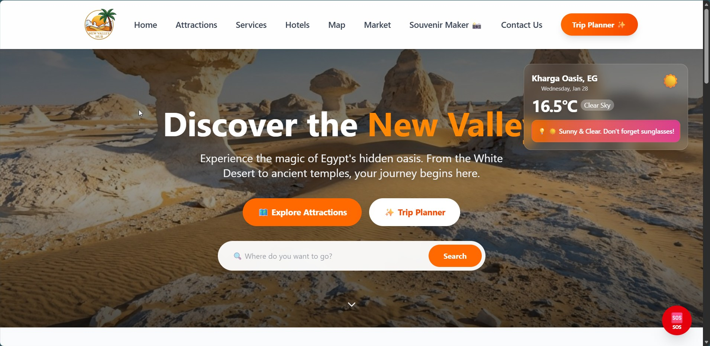
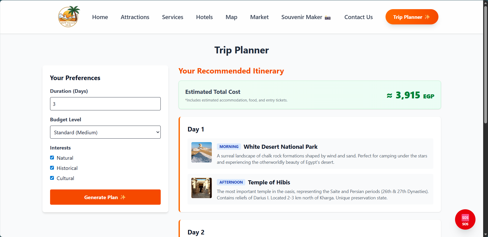
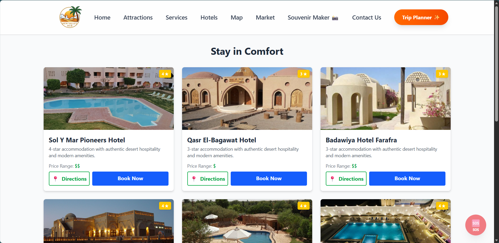
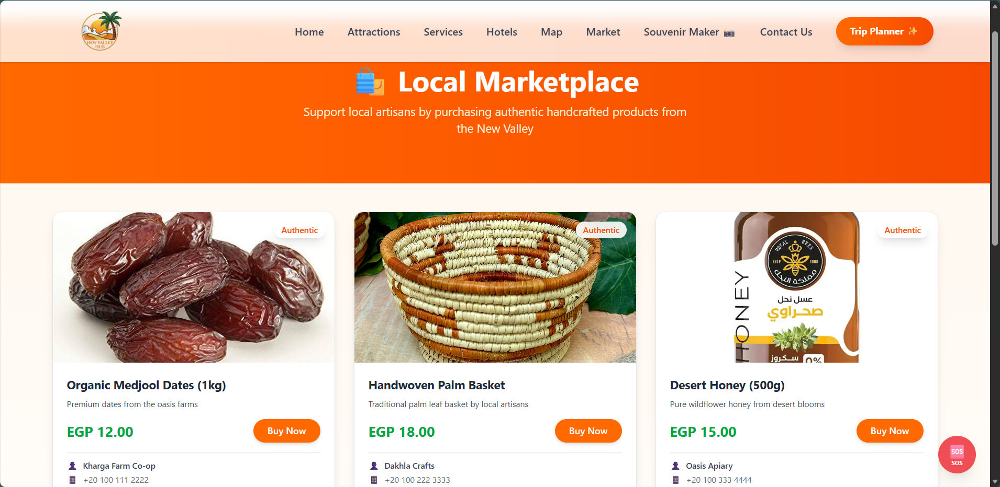
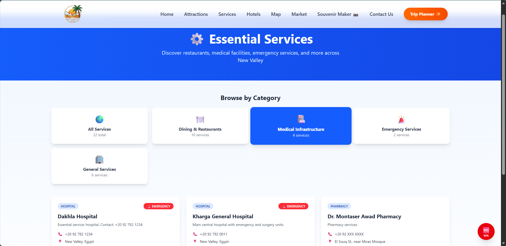
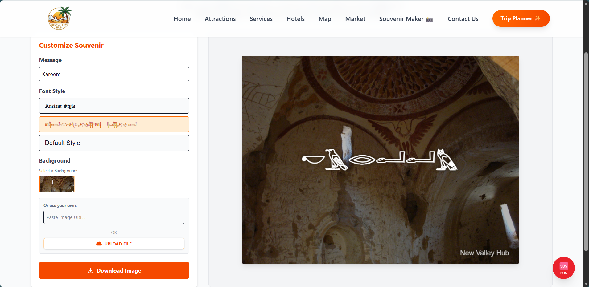
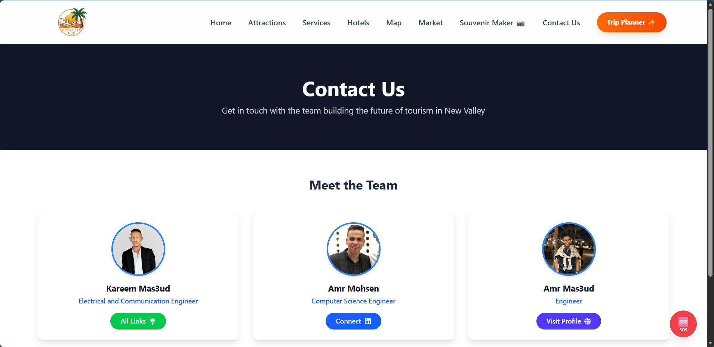

# New Valley Hub (بوابة الوادي الجديد) 🌴

> **"Discover the Magic of Egypt's Hidden Oasis - AI-Powered Digital Tourism Platform"**


---

## 📖 About the Project

**New Valley Hub** is a comprehensive full-stack digital tourism platform dedicated to the New Valley Governorate (Al-Wadi Al-Gadid) in Egypt. Built with modern web technologies and powered by Google Gemini AI, this platform connects travelers with the rich heritage and hidden gems of the region—from the surreal landscapes of the White Desert to the historic oasis towns of Kharga and Dakhla.

Developed for the **"New Valley Innovates" Hackathon 2026**, this project demonstrates the power of AI-driven tourism experiences, RAG (Retrieval-Augmented Generation), and progressive web applications.

---

## 🔥 Key Features

### 🤖 AI Chatbot - "3m Sa3ed" (عم سعيد)
**Your Virtual Local Guide powered by Google Gemini AI.**

* **Intelligent Conversations:** Powered by `gemini-flash-latest` model for fast, context-aware responses
* **RAG-Enhanced Search:** Retrieves real-time data from the database (Attractions, Hotels) to provide accurate, up-to-date information
* **Friendly Persona:** Welcomes users with "Ahlan ya habibi!" and responds in friendly English with Egyptian Arabic expressions
* **Modern UI/UX:**
  - Floating button with pulse animation and gradient (emerald to teal)
  - Call-to-action label: "Ask 3m Sa3ed 🐫" with bounce animation
  - Smooth chat window transitions with scale and opacity effects
  - Auto-scroll to latest messages
  - Message bubbles with distinct user (blue) and AI (gradient green) styling

**Technical Implementation:**
```python
# Backend: ChatAPIView (views.py)
- POST endpoint: /api/tourism/chat/
- RAG: Searches Attractions & Hotels using Django Q objects
- Prompt: "You are '3m Sa3ed', a helpful guide for New Valley Egypt"
- Returns: AI-generated response from Gemini
```

---

### 🔍 Global Search Engine
**Unified search across all content types.**

* **Multi-Model Search:** Searches Attractions, Hotels, and Products simultaneously
* **Smart Filtering:** Uses Django Q objects for name and description matching
* **Rich Results:** Returns type-specific data (category, rating, price)
* **Absolute URLs:** Images served with full URLs for frontend compatibility
* **Performance:** Limits to 10 results per model (30 max total)
* **Type-Specific Badges:** Visual indicators for attraction, hotel, or product results

**API Endpoint:**
```
GET /api/tourism/search/?q={query}
Response: { results: [...], count: 13, query: "desert" }
```

---

### ✨ AI-Powered Trip Planner
**Smart itinerary generator for personalized travel experiences.**

* **Customizable Plans:** Generate itineraries based on days, budget, and interests
* **Budget Tiers:** Low, Medium, High options
* **Interest-Based:** Filter by natural, historical, or cultural attractions
* **API Integration:** Uses custom `generate_itinerary()` function

**Endpoint:**
```
POST /api/tourism/attractions/generate_plan/
Body: { days: 3, budget: "medium", interests: ["natural", "historical"] }
```

---

### 🗺️ Interactive Map & Attractions
* **Leaflet Integration:** Interactive maps with `react-leaflet`
* **Offline Support:** Static map fallback when offline
* **Attraction Cards:** Hover zoom effect (scale-105) with smooth transitions
* **Filtering System:** Filter by type (All, Natural, Historical, Cultural) with live counts
* **Rich Metadata:** Visit duration, ticket prices, opening hours

---

### 🛍️ Local Marketplace (Souq)
* **Artisan Products:** Digital market for local crafts, pottery, and dates
* **Product Listings:** Name, description, price (EGP), seller contact
* **Image Support:** External image URLs via URLField
* **Search Integration:** Products included in global search

---

### 🏨 Hotels & Accommodation
* **Star Ratings:** 1-5 star classification system
* **Direct Booking:** Links to Booking.com or external reservation pages
* **Price Ranges:** Budget ($), Moderate ($$), Luxury ($$$) indicators
* **Location Data:** Google Maps integration for each hotel
* **Contact Details:** Email and phone number support

---

### 📸 Digital Souvenir Maker
**Interactive Canvas-based photo editor.**

* **Custom Backgrounds:** Select from Digital Artifacts collection
* **Text Overlays:** Add personalized messages
* **Custom Fonts:** Scoped local font loading for unique typography
* **Download Feature:** Export creations as images

---

### 🆘 Emergency SOS Button
**Quick access to emergency services.**

* **Floating Action Button:** Fixed position in bottom-right corner
* **Emergency Contacts:**
  - 🚑 Ambulance: 123
  - 🚓 Police: 122
  - 👮 Tourist Police: 126
* **One-Tap Calling:** Direct `tel:` links for instant dialing
* **Animated UI:** Pulse animation on main button, smooth menu expansion

---

### 📴 Offline Features
* **PWA Support:** Progressive Web App with `vite-plugin-pwa`
* **Offline Indicator:** Visual banner when internet connection is lost
* **Service Workers:** Caching for offline functionality
* **Installable:** Can be added to home screen on mobile devices

---

### 👥 Meet the Team
**Smart social link detection and display.**

* **Auto-Detection:** Intelligent URL parsing for platform-specific branding
* **Supported Platforms:**
  - **GitHub:** 🖤 Dark button with "View Code"
  - **LinkedIn:** 💙 Blue button with "Connect"
  - **Instagram:** 🌈 Gradient (pink-purple-yellow) button with "Follow"
  - **Linktree:** 💚 Green button with "All Links"
  - **Generic:** 🌐 Indigo button with "Visit Profile"
* **Hover Effects:** Cards lift and scale on hover (z-10 stacking context)
* **Dynamic Icons:** React-icons integration (FaGithub, FaLinkedin, FaInstagram, etc.)

**Social Link Logic:**
```javascript
// TeamSection.jsx - getLinkProps()
if (url.includes('instagram.com')) {
  return { 
    icon: <FaInstagram />, 
    text: 'Follow', 
    color: 'bg-gradient-to-r from-pink-500 via-purple-500 to-yellow-500'
  };
}
```

---

### 🏛️ Governor's Profile Section
* **Official Representation:** Dedicated section for the Governor's message
* **Singleton Pattern:** Only one profile instance (pk=1)
* **Photo Upload:** Profile photo with ImageField
* **Editable Content:** Welcome message, career highlights, title
* **Default Arabic Content:** Pre-populated with Governor's information

---

### 🎨 Modern UI/UX Design
* **Responsive Grid Layouts:** 1 column (mobile), 2 (tablet), 3 (desktop)
* **Hover Animations:**
  - Cards scale to 105% on hover
  - Shadow elevation (shadow-md → shadow-xl)
  - Smooth transitions (300ms duration)
* **Gradient Themes:**
  - Primary: Orange to Yellow (brand identity)
  - Chatbot: Emerald to Teal (AI personality)
  - Instagram: Pink-Purple-Yellow (platform authentic)
* **Loading States:** Animated spinners with brand colors
* **Empty States:** Friendly messages with action buttons

---

## 🛠️ Tech Stack

### Frontend
| Technology | Version | Purpose |
|:-----------|:--------|:--------|
| **React** | 19.2.0 | UI framework with hooks and functional components |
| **Vite** | 7.2.4 | Lightning-fast build tool and dev server |
| **Tailwind CSS** | 4.1.18 | Utility-first styling with custom gradients |
| **React Router** | 7.13.0 | Client-side routing (10 pages) |
| **Axios** | 1.13.3 | HTTP client for API requests |
| **React Icons** | 5.5.0 | Icon library (Fa*, Si* icons) |
| **React Leaflet** | 5.0.0 | Interactive maps |
| **Leaflet** | 1.9.4 | Map rendering engine |
| **vite-plugin-pwa** | 1.2.0 | Progressive Web App support |

### Backend
| Technology | Version | Purpose |
|:-----------|:--------|:--------|
| **Django** | 5.2.10 | Web framework and ORM |
| **Django REST Framework** | 3.16.1 | RESTful API architecture |
| **google-generativeai** | Latest | Google Gemini AI integration |
| **Pillow** | 12.1.0 | Image processing for uploads |
| **django-cors-headers** | 4.9.0 | CORS configuration for React frontend |

### Database
* **Development:** SQLite (included)
* **Production:** PostgreSQL (recommended)

---

## 📂 Project Structure

```
new-valley-hub/
├── backend/
│   ├── tourism/
│   │   ├── models.py          # Attraction, Hotel, TeamMember, GovernorProfile
│   │   ├── views.py           # ChatAPIView, SearchAPIView, ViewSets
│   │   ├── serializers.py     # DRF serializers
│   │   ├── urls.py            # API routes (/chat/, /search/, etc.)
│   │   └── ai_planner.py      # Trip itinerary generator
│   ├── hospitality/
│   │   └── models.py          # Hotel model with stars, booking_url
│   ├── marketplace/
│   │   └── models.py          # Product model
│   ├── core/
│   │   └── models.py          # BaseLocationModel (shared fields)
│   └── manage.py
├── frontend/
│   ├── src/
│   │   ├── components/
│   │   │   ├── ChatbotWidget.jsx      # AI chatbot UI
│   │   │   ├── TeamSection.jsx        # Team cards with social links
│   │   │   ├── SOSButton.jsx          # Emergency contacts
│   │   │   ├── OfflineIndicator.jsx   # Network status
│   │   │   ├── Navbar.jsx             # Navigation + PWA install
│   │   │   └── AttractionCard.jsx     # Reusable card component
│   │   ├── pages/
│   │   │   ├── HomePage.jsx           # Landing + search bar
│   │   │   ├── SearchResults.jsx      # Global search UI
│   │   │   ├── AttractionsPage.jsx    # Filterable attractions
│   │   │   ├── HotelsPage.jsx         # Accommodation listings
│   │   │   ├── PlannerPage.jsx        # AI trip planner
│   │   │   ├── MarketplacePage.jsx    # Local products
│   │   │   ├── SouvenirPage.jsx       # Canvas editor
│   │   │   ├── MapPage.jsx            # Interactive map
│   │   │   ├── ServicesPage.jsx       # Utilities & services
│   │   │   └── ContactPage.jsx        # Contact information
│   │   ├── services/
│   │   │   └── api.js                 # Axios API client
│   │   ├── App.jsx                    # Root component + routing
│   │   └── index.css                  # Global Tailwind styles
│   └── package.json
├── screenshots/                        # Feature screenshots (12 files)
└── README.md
```

---

## 🚀 Getting Started

### Prerequisites
* **Python** 3.10+ (for Django backend)
* **Node.js** 18+ (for React frontend)
* **Google Gemini API Key** (for AI chatbot)

### Installation

1. **Clone the Repository**
   ```bash
   git clone https://github.com/karim238253/new-valley-hub.git
   cd new-valley-hub
   ```

2. **Backend Setup**
   ```bash
   cd backend
   pip install -r requirements.txt
   
   # Add your Gemini API key to environment
   export GEMINI_API_KEY="your_api_key_here"  # Linux/Mac
   set GEMINI_API_KEY=your_api_key_here       # Windows CMD
   $env:GEMINI_API_KEY="your_api_key_here"    # Windows PowerShell
   
   # Run migrations
   python manage.py migrate
   
   # Create admin user (optional)
   python manage.py createsuperuser
   
   # Start development server
   python manage.py runserver
   ```
   Backend will run on `http://127.0.0.1:8000`

3. **Frontend Setup**
   ```bash
   cd frontend
   npm install
   npm run dev
   ```
   Frontend will run on `http://localhost:5173`

4. **Access the Application**
   * **Frontend:** http://localhost:5173
   * **Backend API:** http://127.0.0.1:8000/api/
   * **Django Admin:** http://127.0.0.1:8000/admin/

---

## 📸 Screenshots

| Home Page | AI Trip Planner ✨ |
| :---: | :---: |
|  |  |

| Interactive Map | Attractions |
| :---: | :---: |
|  |  |

| Hotels | Local Market 🛍️ |
| :---: | :---: |
|  |  |

| Services | Souvenir Maker |
| :---: | :---: |
|  |  |

| Governor's Section | Team Section |
| :---: | :---: |
|  |  |

| AI Chatbot - 3m Sa3ed 🤖 | SOS Emergency Button |
| :---: | :---: |
|  |  |

---

## 🔌 API Endpoints

### Tourism APIs
* `GET /api/tourism/attractions/` - List all attractions
* `POST /api/tourism/attractions/generate_plan/` - Generate trip itinerary
* `GET /api/tourism/hotels/` - List all hotels
* `GET /api/tourism/products/` - List all marketplace products
* `GET /api/tourism/team/` - List team members
* `GET /api/tourism/governor/` - Get governor profile

### AI & Search
* `POST /api/tourism/chat/` - AI chatbot (3m Sa3ed)
  - Body: `{ "message": "Tell me about White Desert" }`
  - Response: `{ "response": "..." }`
* `GET /api/tourism/search/?q={query}` - Global search
  - Response: `{ results: [...], count: 13, query: "desert" }`

---

## 🎯 Key Code Highlights

### RAG Implementation (Retrieval-Augmented Generation)
```python
# backend/tourism/views.py - ChatAPIView
context_results = []
attractions = Attraction.objects.filter(
    Q(name__icontains=user_message) | Q(description__icontains=user_message)
)[:2]
for item in attractions:
    context_results.append(f"Place: {item.name} - {item.description[:150]}")

context_str = "\n".join(context_results)
prompt = f"System: You are '3m Sa3ed', a helpful guide... Context: {context_str}..."
response = model.generate_content(prompt)
```

### Pointer Events Fix (UI Interaction)
```jsx
// ChatbotWidget.jsx - Prevents blocking clicks on underlying elements
<div className="fixed bottom-6 right-24 z-50 pointer-events-none">
  <div className="pointer-events-auto"> {/* Chat Window */}
  <button className="pointer-events-auto"> {/* Chat Button */}
</div>
```

### Hover Zoom Effect
```jsx
// AttractionCard.jsx
<div className="transition-all duration-300 hover:scale-105 hover:shadow-xl">
  {/* Card content */}
</div>
```

---

## 🌟 Unique Features

1. **RAG-Powered AI:** Unlike generic chatbots, 3m Sa3ed searches the actual database before responding
2. **Multi-Model Search:** Single search bar queries 3 different content types simultaneously
3. **Instagram Gradient:** Authentic platform colors for social links (pink-purple-yellow)
4. **Absolute Image URLs:** Backend generates full URLs for seamless frontend consumption
5. **Pointer Events Management:** Chat widget doesn't block page interactions
6. **SOS Integration:** Emergency services one tap away for tourist safety
7. **PWA Ready:** Installable web app with offline support

---

## 🤝 Contributing

This project was built for the **"New Valley Innovates" Hackathon 2026**. Contributions are welcome!

1. Fork the repository
2. Create a feature branch (`git checkout -b feature/AmazingFeature`)
3. Commit your changes (`git commit -m 'Add some AmazingFeature'`)
4. Push to the branch (`git push origin feature/AmazingFeature`)
5. Open a Pull Request

---

## 📝 License

This project is developed for educational and hackathon purposes. 

---

## 👨‍💻 Team

Built with ❤️ by the New Valley Hub team for **New Valley Governorate** 🇪🇬

Check the **Meet the Team** section in the app to see developer profiles, GitHub repositories, and LinkedIn connections!

---

## 🙏 Acknowledgments

* **Google Gemini AI** for powering our intelligent chatbot
* **New Valley Governorate** for inspiring this digital transformation
* **React & Django Communities** for excellent documentation
* **Tailwind CSS** for making beautiful UIs achievable

---

**Made with ❤️ for New Valley** 🏜️✨

*"Connecting Heritage with Innovation"*
