<div align="center">
  
  
  <h1>New Valley Hub (بوابة الوادي الجديد) 🏜️</h1>
  
  <p><strong>"Discover Egypt's Hidden Oasis Through Premium Digital Tourism"</strong></p>
  
  <p>
    
    
    
    
    
    
    
    
  </p>
</div>

---

## 📖 About the Project

**New Valley Hub** is a premium, AI-powered digital tourism platform celebrating the majestic New Valley Governorate (الوادي الجديد) in Egypt. From the otherworldly landscapes of the White Desert to the ancient oasis towns of Kharga and Dakhla, we bring Egypt's hidden treasures to the world through cutting-edge technology and luxurious design.

Built for the **"New Valley Innovates" Hackathon 2026**, this Progressive Web Application showcases the perfect fusion of heritage and innovation through AI-driven experiences, sophisticated UI/UX, and offline-first architecture.

**🏆 Key Achievements:**
- ✨ **Luxury Earthy Design System** - Premium ceramic-effect UI with warm, sophisticated color palette
- 🤖 **RAG-Powered AI Chatbot** - "3m Sa3ed" local guide with real-time database integration
- 🎨 **Interactive Souvenir Maker** - Canvas-based editor with ancient Egyptian fonts
- 🔐 **JWT Authentication & Dashboard** - Personalized "My Trips" dashboard to save Eco-Trips and Souvenirs
- 🗺️ **Offline-First PWA** - Full functionality without internet connectivity
- 📱 **Installable App** - Native-like experience on all devices
- 🌿 **Eco-Trip Analyzer** - Dynamic carbon footprint calculator with personalized Net-Zero badges aligned to SDG 13
- 💎 **Glassmorphism Premium UI** - Parallax hero section, floating morphing navbar, and Framer Motion scroll-reveal animations
- 🛍️ **SDG 8 Marketplace** - Empowering New Valley artisans with a fair-trade digital storefront

---

## 📸 Platform Previews

Take a tour of the New Valley Hub experience.

<table style="width: 100%; text-align: center;">
  <tr>
    <th style="text-align: center;"><b>Home Page & Hero Section</b></th>
    <th style="text-align: center;"><b>Secure Authentication 🔐</b></th>
  </tr>
  <tr>
    <td align="center">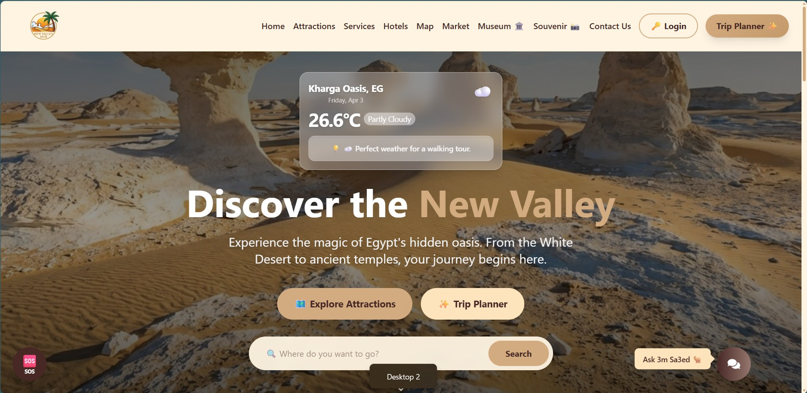</td>
    <td align="center">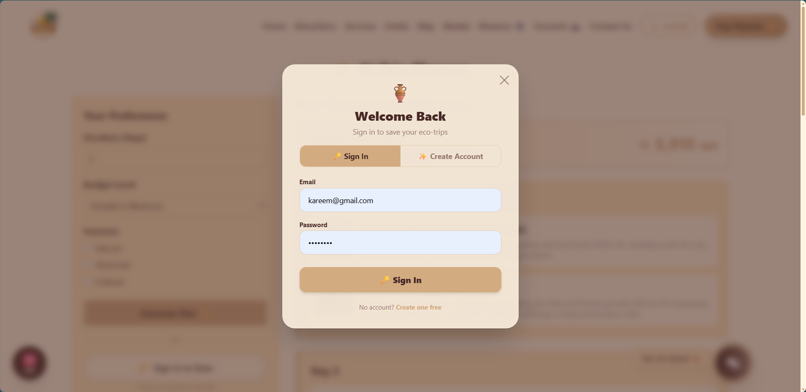</td>
  </tr>
  <tr>
    <th style="text-align: center;"><b>AI Trip Planner ✨</b></th>
    <th style="text-align: center;"><b>Eco-Analyzer & Itinerary 📊</b></th>
  </tr>
  <tr>
    <td align="center">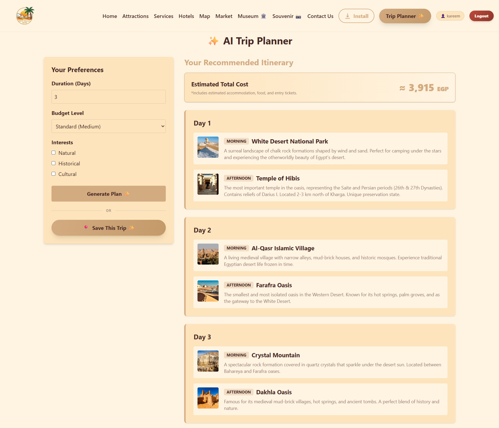</td>
    <td align="center">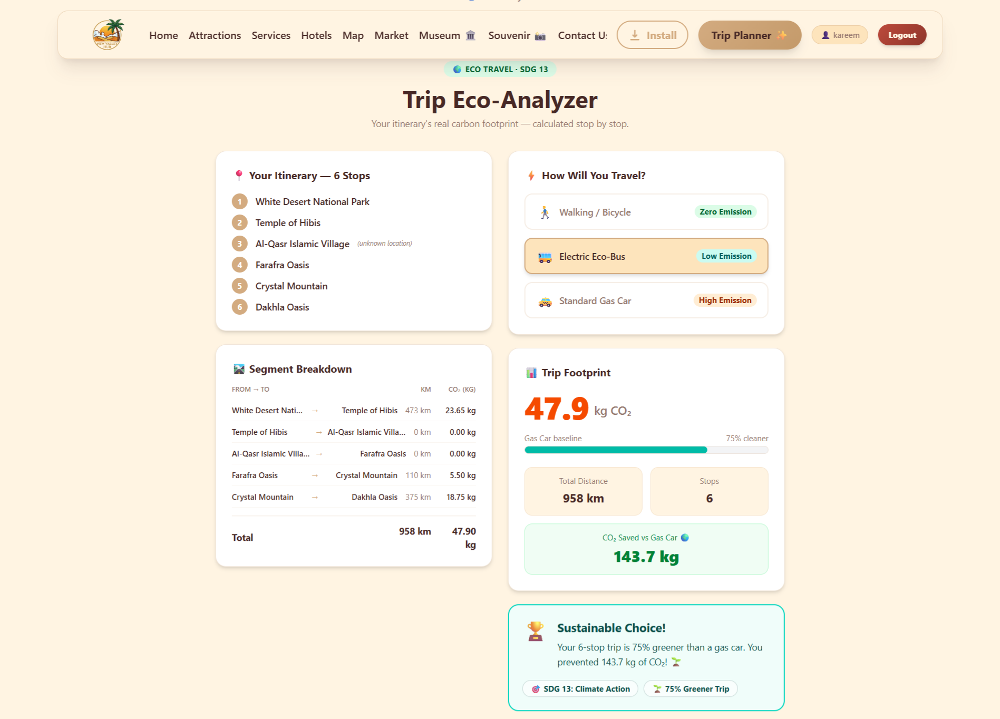</td>
  </tr>
  <tr>
    <th style="text-align: center;"><b>User Dashboard 👤</b></th>
    <th style="text-align: center;"><b>Digital Souvenir Creator 📸</b></th>
  </tr>
  <tr>
    <td align="center">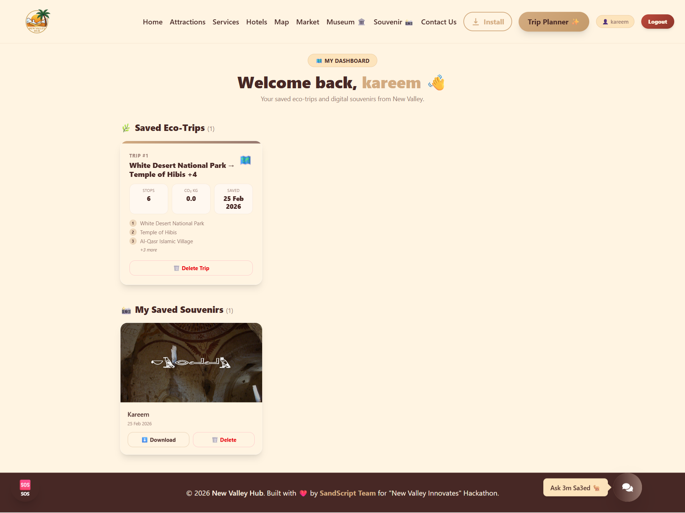</td>
    <td align="center">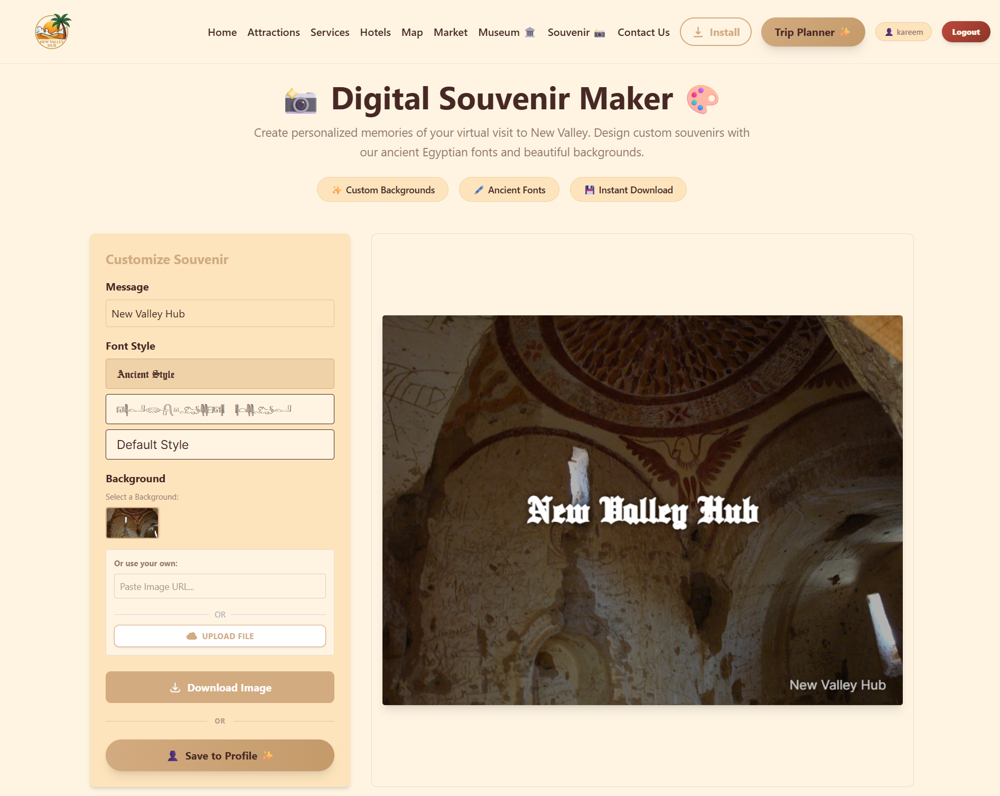</td>
  </tr>
  <tr>
    <th style="text-align: center;"><b>AI Chatbot - 3m Sa3ed 🤖</b></th>
    <th style="text-align: center;"><b>Interactive Map 🗺️</b></th>
  </tr>
  <tr>
    <td align="center">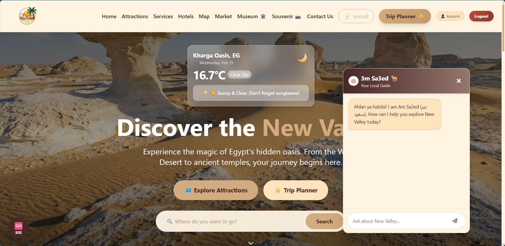</td>
    <td align="center">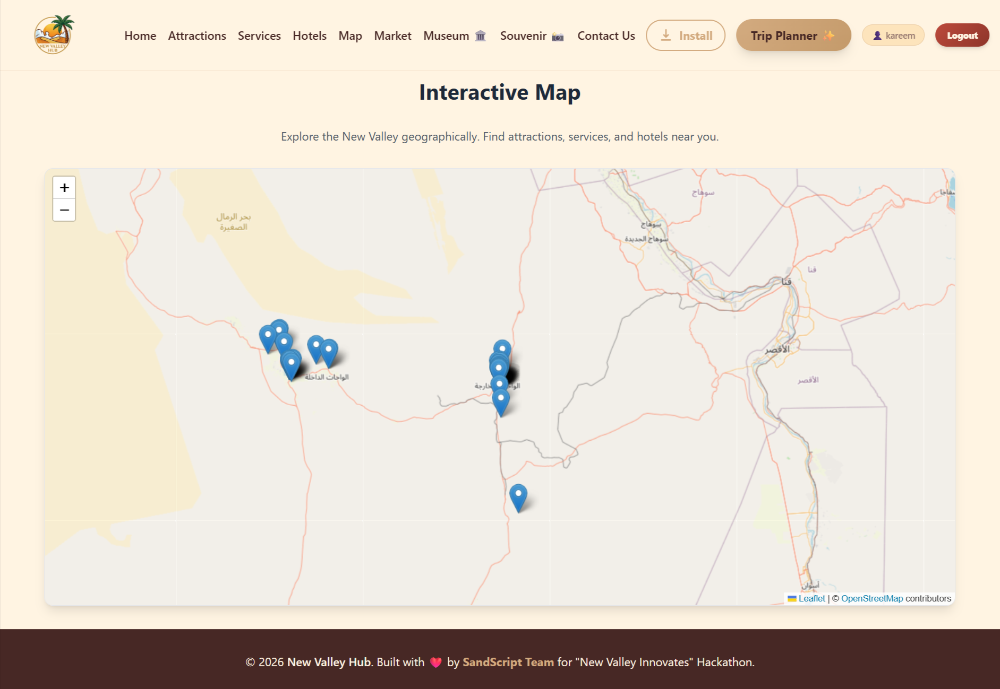</td>
  </tr>
  <tr>
    <th style="text-align: center;"><b>Attractions Explorer 🏛️</b></th>
    <th style="text-align: center;"><b>Virtual Museum 🏺</b></th>
  </tr>
  <tr>
    <td align="center">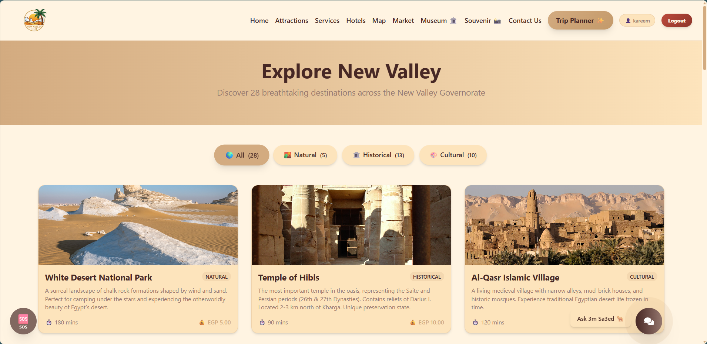</td>
    <td align="center">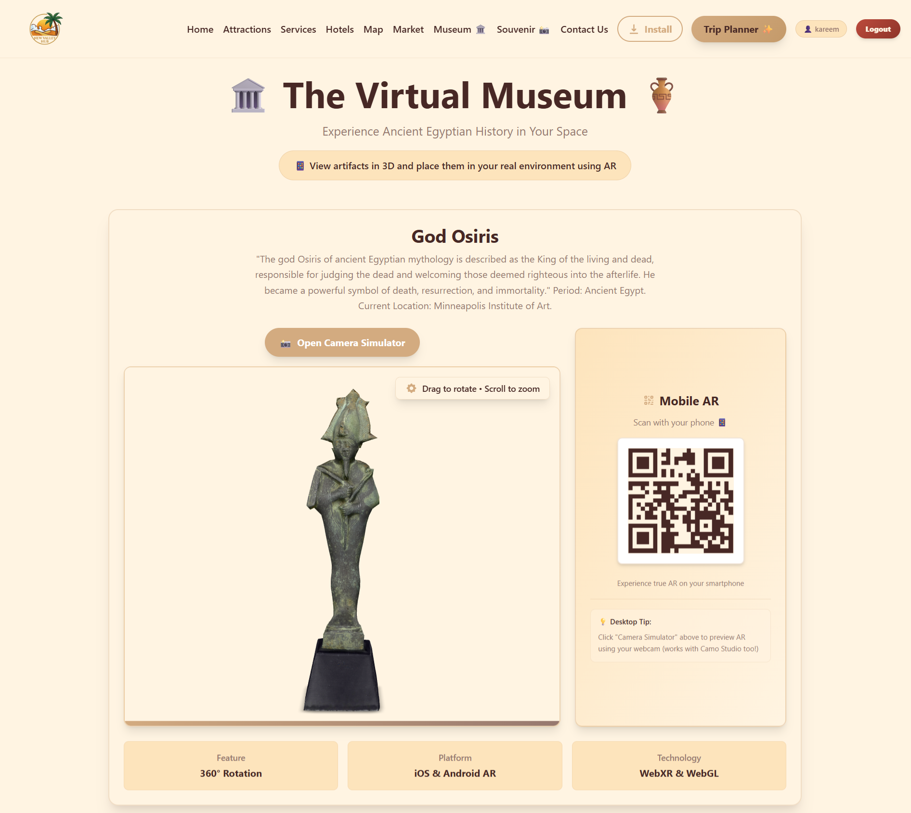</td>
  </tr>
  <tr>
    <th style="text-align: center;"><b>Luxury Stays & Hotels 🏨</b></th>
    <th style="text-align: center;"><b>Artisan Marketplace 🛍️</b></th>
  </tr>
  <tr>
    <td align="center">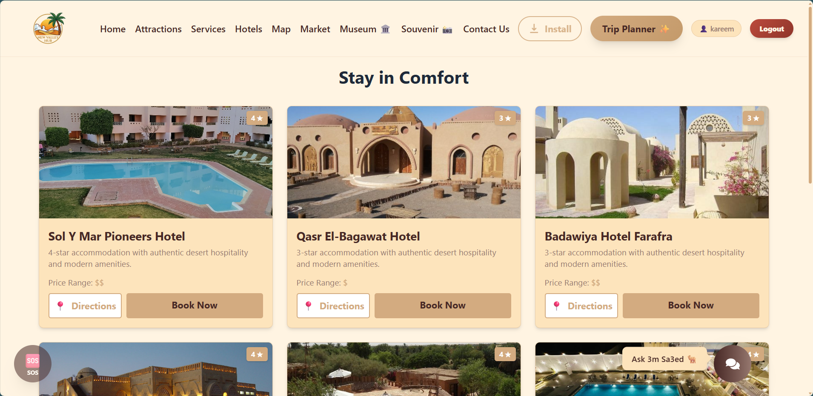</td>
    <td align="center">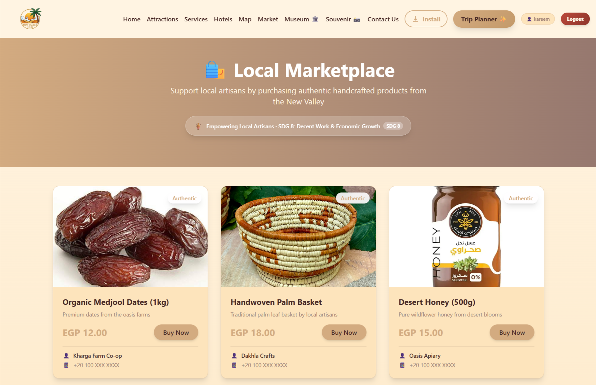</td>
  </tr>
  <tr>
    <th style="text-align: center;"><b>Local Services 🛠️</b></th>
    <th style="text-align: center;"><b>SOS & Emergency 🆘</b></th>
  </tr>
  <tr>
    <td align="center">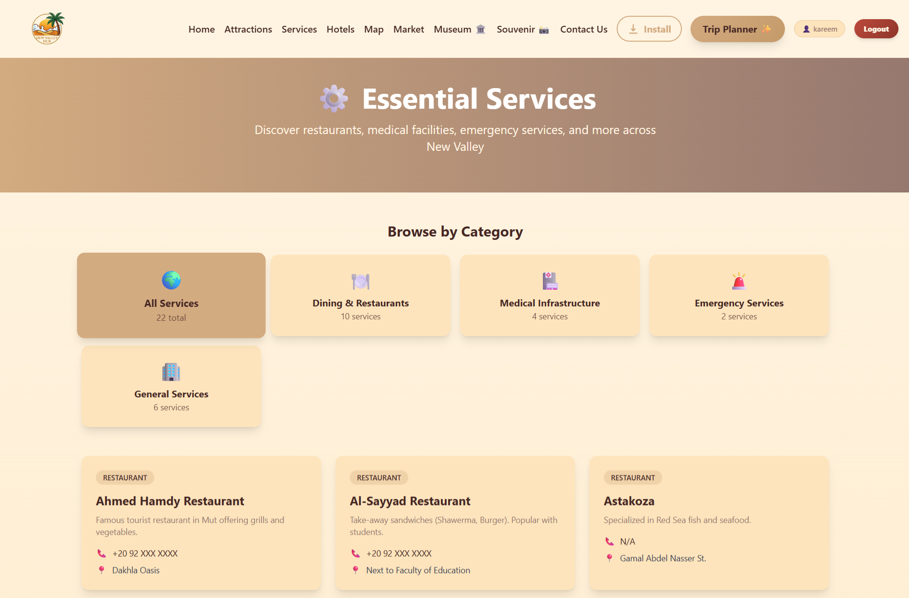</td>
    <td align="center">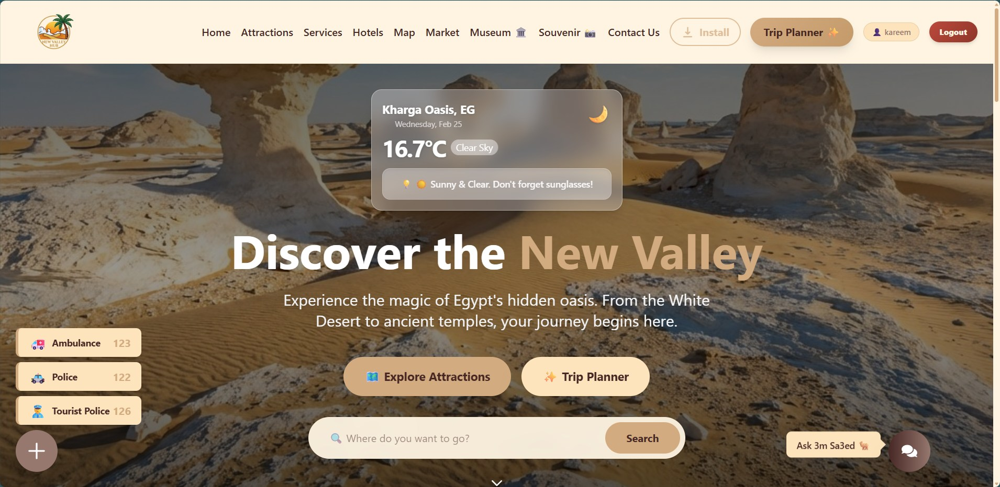</td>
  </tr>
  <tr>
    <th style="text-align: center;"><b>Governor's Vision 🇪🇬</b></th>
    <th style="text-align: center;"><b>Meet the SandScript Team ❤️</b></th>
  </tr>
  <tr>
    <td align="center">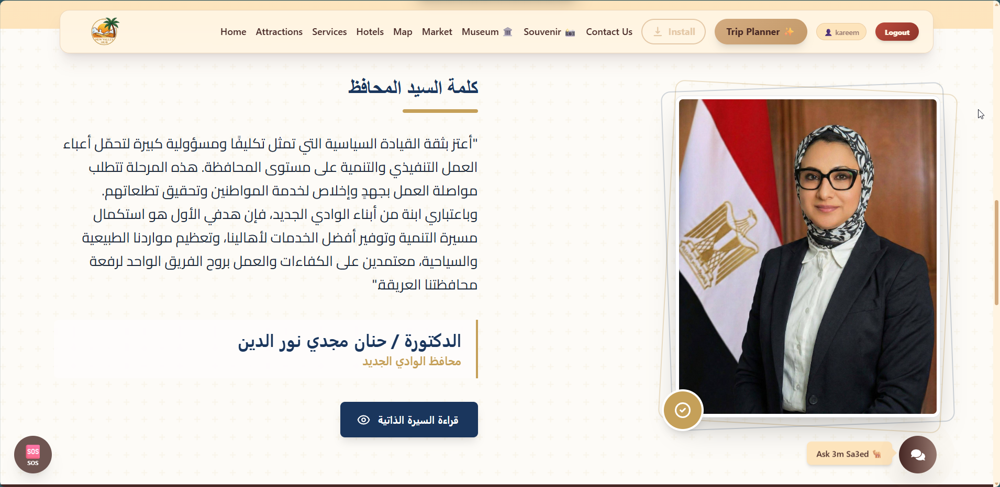</td>
    <td align="center">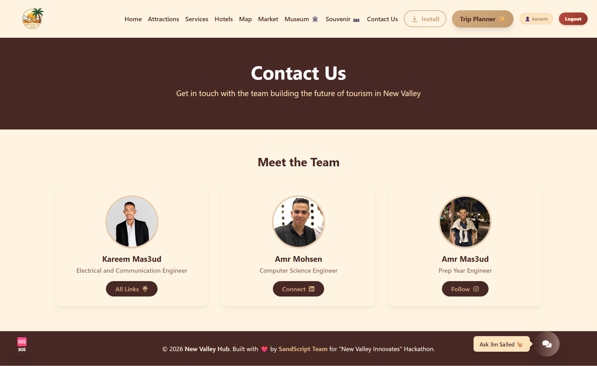</td>
  </tr>
</table>
---

## 📑 Table of Contents

1. [About the Project](#-about-the-project)
2. [Platform Previews](#-platform-previews)
3. [Design Philosophy](#-design-philosophy-luxury-earthy-theme)
4. [Flagship Features](#-flagship-features)
5. [SDG Alignment](#-sdg-alignment)
6. [Technology Stack](#-technology-stack)
7. [Project Architecture](#-project-architecture)
8. [Getting Started](#-getting-started)
9. [API Documentation](#-api-documentation)
10. [Key Technical Highlights](#-key-technical-highlights)
11. [Unique Value Propositions](#-unique-value-propositions)

---

## 🎨 Design Philosophy: "Luxury Earthy" Theme

Our design system embodies the warmth of the Egyptian desert with a premium, minimalist aesthetic.

### Color Palette

```css
🍫 Dark Chocolate (#472825) - Primary text, headings, deep elegance
🌅 Medium Taupe (#96786F) - Secondary text, subtle sophistication  
✨ Golden Sand (#D3AB80) - Buttons, accents, warm highlights
🥐 Creamy Beige (#FDE4BC) - Card backgrounds, secondary elements
🏺 Ivory White (#FFF4E2) - Main backgrounds, pristine canvas
```

### Signature UI Elements

**🧭 Morphing Solid Header**
- **At Top:** Full-width solid ivory header with bottom border
- **On Scroll:** Transforms into centered floating capsule (rounded-full)
- **Effect:** Premium "ceramic pill" with golden sand border and warm shadow
- **Transition:** Smooth 500ms animation with centered positioning

**💎 Ceramic Effect Components**
- Solid, opaque backgrounds (no transparency/blur)
- Subtle golden accents and warm shadows
- High readability with dark brown text
- Card hover effects with gentle elevation

**🌟 Premium Interactions**
- Logo dynamically resizes on scroll (h-12 → h-10)
- Cards scale to 105% on hover with shadow enhancement
- Smooth 300-500ms transitions throughout
- Unified Dark Brown/Golden Sand social buttons

---

## 🔥 Flagship Features

### 🔐 Secure JWT Authentication & Personalized Dashboard
**A dedicated space for users to save and manage their digital tourism memories.**
- **My Trips Dashboard (`/my-trips`):** View saved AI-generated Eco-Trips and custom Digital Souvenirs in a premium glassmorphic grid layout.
- **Robust JWT Security:** Backend authentication via `djangorestframework-simplejwt` with seamlessly integrated React Context provider (`AuthContext`) managing application state.
- **Save to Profile:** Single-click "Save" logic injected directly into the Trip Planner and Souvenir Maker components. 

### 🤖 "3m Sa3ed" (عم سعيد) - Your AI Local Guide
**The most intelligent tourism chatbot in Egypt, powered by Google Gemini AI with RAG technology.**
- **RAG-Enhanced Responses:** Searches attractions and hotels in real-time before answering
- **Contextual Awareness:** Uses actual database content to provide accurate, up-to-date information
- **Friendly Persona:** Welcomes with "Ahlan ya habibi!" in authentic Egyptian style

### ✨ AI-Powered Trip Planner
**Intelligent itinerary generator with cost estimation.**
- **Interest-Based Filtering:** Natural, Historical, Cultural attractions
- **Budget Tiers:** Low (550 EGP/day), Medium (1,300 EGP/day), High (3,500 EGP/day)
- **Smart Scheduling:** 2 activities per day (Morning/Afternoon)
- **Cost Calculation:** Base cost + ticket prices for accurate budgeting

### 🌿 Eco-Trip Analyzer — SDG 13: Climate Action
**The platform's sustainability flagship: a dynamic carbon footprint calculator tightly integrated with the AI Trip Planner.**
When a user generates their AI itinerary, the Eco-Analyzer automatically calculates the full trip's CO₂ footprint.
- **Distance Engine:** Hardcoded triangular distance matrix covering 15 key New Valley locations.
- **Transport Modes:** Compare Walking (Net-Zero), Electric Eco-Bus, and Standard Gas Car carbon outputs.
- **Personalized Output:** "Your 4-stop trip is 75% greener than driving!" alongside a dynamic CO₂ progress bar.

### 🛍️ SDG 8 Marketplace — Decent Work & Economic Growth
**More than a shop — a direct economic lifeline for New Valley artisans.**
- **Impact Integration:** "Empowering Local Artisans" glassmorphism capsules dynamically featured in the hero section.
- **Product Cards:** Display product details, seller name, and contact details for direct peer-to-peer purchasing.

### 📸 Digital Souvenir Maker
**Professional canvas-based photo editor with Egyptian themes.**
- **Background Selection:** Choose from Digital Artifacts collection or upload a custom image URL.
- **Ancient Typography:** Exclusive fonts (Ancient, Hieroglyphs) scoped locally.
- **Export & Save:** Download as PNG or save directly to the personalized user dashboard.

### 🔍 Global Search Engine
**Unified search across all content types with intelligent categorization.**
- Searches simultaneously across Attractions, Hotels, and Products. Returns grouped logic via `GET /api/tourism/search/?q=` endpoint.

### 🗺️ Interactive Maps & Offline Support
**Leaflet-powered maps with full offline fallback.**
- Real-time marker rendering with an active offline static map fallback managed via PWA service workers.

### 🆘 Emergency SOS Button
**One-tap access to critical services for tourist safety.**
- Fixed pulse-animated button with direct `tel:` links to Ambulance, Police, and Tourist Police.

### 📴 Progressive Web App (PWA)
**Installable, offline-first architecture for native-like experience.**
- Uses `vite-plugin-pwa` for Service Worker caching, Add to Home Screen, and background synchronization capabilities.

---

## 🌍 SDG Alignment

New Valley Hub is purpose-built around the UN Sustainable Development Goals:

| # | UN Goal | How We Implement It |
|---|---|---|
| **SDG 8** | Decent Work & Economic Growth | Marketplace platform sells New Valley artisan goods directly to tourists; SDG 8 glassmorphism badge in the hero. |
| **SDG 13** | Climate Action | Eco-Trip Analyzer calculates CO₂ per trip segment, rewards low-emission transport. |
| **SDG 11** | Sustainable Cities & Communities | Promotes cultural heritage preservation; surfaces protected natural areas. |
| **SDG 4** | Quality Education | Virtual Museum with `@google/model-viewer` 3D/AR artifacts; educational history content. |
| **SDG 17** | Partnerships for the Goals | Open Django REST API allows local businesses, government bodies, and NGOs to integrate. |

---

## 🛠️ Technology Stack

### Frontend Architecture

| Technology | Version | Purpose |
|:-----------|:--------|:--------|
| **React** | 19.2.0 | Modern UI with hooks and functional components |
| **Vite** | 7.2.4 | Lightning-fast HMR and optimized builds |
| **Tailwind CSS** | 4.1.18 | Utility-first styling with custom luxury palette |
| **Framer Motion** | 12.x | Scroll-reveal animations, hero transitions |
| **React Router** | 7.13.0 | Client-side routing across components |
| **Axios** | 1.13.3 | Promise-based HTTP client |
| **React Leaflet** | 5.0.0 | Interactive map components |

### Backend Architecture

| Technology | Version | Purpose |
|:-----------|:--------|:--------|
| **Django** | 5.2.10 | Web framework with powerful ORM |
| **Django REST Framework** | 3.16.1 | RESTful API with ViewSets and Serializers |
| **SimpleJWT** | Latest | Secure token authentication |
| **google-generativeai** | Latest | Google Gemini AI SDK |
| **Pillow** | 12.1.0 | Image processing for uploads |
| **psycopg2** | 2.9.9 | PostgreSQL adapter |

---

## 📂 Project Architecture

```
new-valley-hub/
├── backend/                    # Django REST API
│   ├── tourism/                # Main tourism app
│   │   ├── models.py          # Attraction, UserSavedTrip, UserSavedSouvenir, etc.
│   │   ├── views.py           # ChatAPIView, SearchAPIView, ViewSets
│   │   ├── auth_views.py      # JWT registration and auth endpoints
│   │   ├── urls.py            # API routes
│   │   ├── auth_urls.py       # Auth API routes
│   │   └── ai_planner.py      # Trip itinerary algorithm
│   ├── hospitality/            # Hotels app
│   ├── marketplace/            # Products app
│   ├── services/               # Services directory
│   └── new_valley_hub/         # Django project settings
├── frontend/                   # React PWA
│   ├── src/
│   │   ├── components/        # Reusable UI components
│   │   │   ├── Navbar.jsx             # Morphing floating navbar (lg breakpoint)
│   │   │   ├── LoginModal.jsx         # Glassmorphism auth modal
│   │   │   ├── TripPlanner.jsx        # Eco-Trip Analyzer (SDG 13)
│   │   │   └── RevealOnScroll.jsx     # Framer Motion scroll-reveal wrapper
│   │   ├── context/
│   │   │   └── AuthContext.jsx        # JWT auth and user state context
│   │   ├── pages/              # Route-based pages
│   │   │   ├── HomePage.jsx           # Parallax hero + features
│   │   │   ├── PlannerPage.jsx        # AI planner + Eco-Analyzer + Save Trip
│   │   │   ├── MyTrips.jsx            # Personalized user dashboard
│   │   │   ├── SouvenirPage.jsx       # Souvenir maker + Save Souvenir
│   │   │   └── (Other Core Pages)     # Map, Marketplace, Hotels, etc.
│   │   ├── services/
│   │   │   └── api.js         # Axios client with auth interceptors & headers
│   │   ├── App.jsx            # Root component + routing
│   │   └── index.css          # Tailwind + global styles
│   ├── dev-dist/              # PWA service worker files
│   └── vite.config.js         # Vite + PWA configuration
├── screenshots/                # Feature screenshots
└── README.md
```

---

## 🚀 Getting Started

### Prerequisites

- **Python** 3.10+ (Django backend)
- **Node.js** 18+ (React frontend)
- **Google Gemini API Key** ([Get it here](https://makersuite.google.com/app/apikey))

### Installation

#### 1️⃣ Clone the Repository

```bash
git clone https://github.com/KareemMas3ud/new-valley-hub.git
cd new-valley-hub
```

#### 2️⃣ Backend Setup

```bash
cd backend

# Create virtual environment (recommended)
python -m venv venv
source venv/bin/activate  # Linux/Mac
venv\Scripts\activate     # Windows

# Install dependencies
pip install -r requirements.txt

# Set Gemini API key
export GEMINI_API_KEY="your_api_key_here"  # Linux/Mac
set GEMINI_API_KEY=your_api_key_here       # Windows CMD
$env:GEMINI_API_KEY="your_api_key_here"    # Windows PowerShell

# Run make migrations
python manage.py makemigrations

# Run migrations
python manage.py migrate

# Seed database (optional)
python seed_comprehensive.py

# Create admin user (optional)
python manage.py createsuperuser

# Start development server
python manage.py runserver
```

**Backend runs on:** `http://127.0.0.1:8000`

#### 3️⃣ Frontend Setup

```bash
cd frontend

# Install dependencies
npm install

# Start development server
npm run dev
```

**Frontend runs on:** `http://localhost:5173`

#### 4️⃣ Access the Application

- **Frontend UI:** http://localhost:5173
- **Backend API:** http://127.0.0.1:8000/api/
- **Django Admin:** http://127.0.0.1:8000/admin/
- **API Docs:** http://127.0.0.1:8000/api/ (browsable)

---

## 🔌 API Documentation

### Auth & User Endpoints
```
POST   /api/auth/register/             Register a new user
POST   /api/auth/token/                Login (obtain JWT pair)
POST   /api/auth/token/refresh/        Refresh JWT token
GET    /api/auth/save-trip/            Get user's saved trips
POST   /api/auth/save-trip/            Save a generated trip
DELETE /api/auth/save-trip/{id}/       Delete a saved trip
GET    /api/auth/souvenirs/            Get user's saved souvenirs
POST   /api/auth/souvenirs/            Save a custom souvenir
DELETE /api/auth/souvenirs/{id}/       Delete a saved souvenir
```

### Core Tourism Endpoints
```
GET    /api/tourism/attractions/             List all attractions
POST   /api/tourism/attractions/generate_plan/   AI trip planner
POST   /api/tourism/chat/                    AI Chatbot inference
GET    /api/tourism/search/?q={query}        Global contextual search
```

---


---

## 🤝 Contributing

This project was built for the **"New Valley Innovates" Hackathon 2026**. We welcome contributions!

1. Fork the repository
2. Create a feature branch (`git checkout -b feature/AmazingFeature`)
3. Commit your changes (`git commit -m 'Add AmazingFeature'`)
4. Push to the branch (`git push origin feature/AmazingFeature`)
5. Open a Pull Request

---

## 👨‍💻 Team - SandScript

**Built with ❤️ by the SandScript Team for New Valley Governorate 🇪🇬**

Our diverse team of developers, designers, and AI specialists came together to create this premium digital tourism experience. Check the **Meet the Team** section in the Contact page to see our profiles, GitHub repositories, and LinkedIn connections!

---

## 📝 License

This project is developed for educational and hackathon purposes.

---

## 🙏 Acknowledgments

- **Google Gemini AI** - Powering our intelligent RAG chatbot
- **New Valley Governorate** - Inspiring this digital transformation
- **OpenStreetMap & Leaflet** - Free, open-source mapping
- **"New Valley Innovates" Hackathon 2026** - Platform for innovation

---

<div align="center">
  
  **Made with ❤️ for New Valley Governorate** 🏜️✨
  
  *"Where Heritage Meets Innovation Through Luxury Design"*
  
  **SandScript Team © 2026**

  <br><br>

  [](https://github.com/KareemMas3ud/new-valley-hub)
  
</div>
