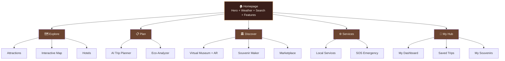
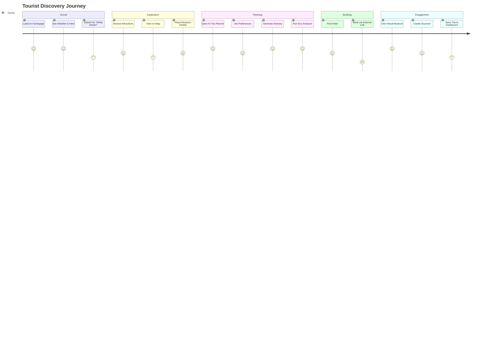

# 🏜️ New Valley Hub — Comprehensive Design Audit & Creative Direction

> **Prepared by:** AI Creative Director & UX Strategist  
> **Platform:** New Valley Hub (بوابة الوادي الجديد)  
> **Team:** SandScript  
> **Date:** June 2026

---

## 1. Overall Design Aesthetics

### 1.1 Current Visual Identity Assessment

Your "Luxury Earthy" theme is an **excellent conceptual foundation**. The palette draws from the desert landscape and connects emotionally to the New Valley's identity. Here's what's currently working and what can be elevated:

#### ✅ What's Working
- The warm, earthy tones feel authentic to the region — not generic or touristy
- The full-bleed hero image of the White Desert is immediately captivating
- Glassmorphism on the weather widget creates depth without competing with the hero
- The "Am Sa3eed" chatbot personality is charming and culturally grounded
- Consistent use of emoji-enhanced labels adds warmth without childishness

#### ⚠️ What Needs Attention
- The palette skews **monotone** — everything is beige-to-brown, which can feel flat across many pages
- There's no **accent contrast color** for critical CTAs, making visual hierarchy harder to parse
- The background `#FFF4E2` (Ivory White) across *every* page creates a "sameness fatigue"
- Some text has insufficient contrast (taupe on beige) which affects readability and WCAG compliance

---

### 1.2 Optimized Color Palette

I recommend evolving from a 5-color monochromatic system to a **7-color semantic system** that preserves the earthy soul but adds functional depth:

```
CORE IDENTITY (keep — these are your DNA)
━━━━━━━━━━━━━━━━━━━━━━━━━━━━━━━━━━━━━━━
🍫 Deep Umber        #3B1F1A    →  Primary text, headers, navbar bg (darker than current)
🏺 Warm Cocoa        #6B4430    →  Secondary text, body copy (better contrast)
✨ Golden Sand        #D3AB80    →  Buttons, accents, highlights (keep)
🥐 Creamy Parchment  #F5E6CC    →  Card backgrounds, secondary surfaces
🏜️ Desert Ivory      #FEF7EC    →  Main page background (slightly warmer)

NEW ADDITIONS (functional depth)
━━━━━━━━━━━━━━━━━━━━━━━━━━━━━━━━━━━━━━━
🌿 Oasis Teal        #2A7B6F    →  SUCCESS states, eco/SDG badges, positive metrics
🌅 Sunset Terracotta  #C4573A    →  URGENT/SOS states, destructive actions, error states
```

#### Why This Works

| Current Issue | Solution | Color |
|:--|:--|:--|
| SOS button uses pink/red that clashes with earthy palette | Terracotta integrates emergency into the design language | `#C4573A` |
| Eco-Analyzer "green" badges look foreign to the palette | Oasis Teal evokes actual oasis water, feels native | `#2A7B6F` |
| "Delete Trip" red button creates visual whiplash | Terracotta communicates danger while staying warm | `#C4573A` |
| No clear visual difference between primary and secondary buttons | Golden Sand (primary) vs. Cocoa outline (secondary) | `#D3AB80` / `#6B4430` |

---

### 1.3 Typography Recommendations

#### Current State
You're using Cairo for Arabic content which is excellent. For Latin content, the defaults appear to be system/sans-serif with some serif mixing.

#### Recommended Type System

| Role | Font | Weight | Usage |
|:--|:--|:--|:--|
| **Display / Hero** | **Playfair Display** | 700, 800 | Page titles, hero text — adds editorial luxury |
| **UI / Body** | **Inter** or **Plus Jakarta Sans** | 400, 500, 600 | Navigation, body text, form labels |
| **Arabic** | **Cairo** (keep) | 400, 600, 700 | All Arabic content |
| **Accent / Special** | **Noto Naskh Arabic** | 400 | Cultural quotes, Quranic references, heritage captions |
| **Data / Numbers** | **Tabular Lining** via Inter | 500 | CO₂ values, prices, statistics (for alignment) |

#### Type Scale (rem-based, fluid)

```css
--text-xs:    clamp(0.694rem, 0.65vi + 0.5rem, 0.8rem);
--text-sm:    clamp(0.833rem, 0.8vi + 0.6rem, 0.95rem);
--text-base:  clamp(1rem, 1vi + 0.7rem, 1.125rem);
--text-lg:    clamp(1.2rem, 1.2vi + 0.8rem, 1.35rem);
--text-xl:    clamp(1.44rem, 1.5vi + 0.9rem, 1.7rem);
--text-2xl:   clamp(1.728rem, 2vi + 1rem, 2.2rem);
--text-3xl:   clamp(2.074rem, 2.5vi + 1.2rem, 3rem);
--text-hero:  clamp(2.8rem, 4vi + 1.5rem, 4.5rem);
```

---

### 1.4 Visual Tone & Art Direction

#### Mood Keywords
> **Ancient Luxury · Desert Serenity · Living Heritage · Warm Innovation**

#### Guiding Principles

1. **"Sand-to-Sky" Gradient Philosophy** — Screens should transition from warm earth tones (bottom/content) to cooler tones (top/navigation), mimicking the desert horizon
2. **Textural Depth** — Introduce subtle sandstone or papyrus micro-textures on hero sections and card backgrounds instead of flat color fills
3. **Light & Shadow** — Use warm directional shadows (`box-shadow: 8px 12px 32px rgba(59,31,26,0.08)`) to create the feeling of desert sunlight hitting architectural elements
4. **Photography Style** — Hero images should favor golden hour (warm) photography, wide landscape ratios, and soft vignettes at edges

---

## 2. Architecture & Design Layout

### 2.1 Information Architecture Map



---

### 2.2 Page-by-Page Layout Audit

#### 🏠 Homepage

**Current Status:** ✅ Strong — best page on the platform

| Component | Assessment | Recommendation |
|:--|:--|:--|
| **Hero Section** | ✅ Stunning White Desert image, parallax effect, clear headline | Add a subtle animated gradient overlay that shifts from golden → transparent to simulate moving light |
| **Weather Widget** | ✅ Great glassmorphism, contextual tips | Move to top-right corner within the hero (avoid obscuring the landscape center) |
| **CTAs** | ⚠️ "Explore Attractions" and "Trip Planner" look identical | Make primary CTA (Explore) filled/golden, secondary (Planner) outlined |
| **Search Bar** | ⚠️ Placed below the fold on some viewports | Integrate search INTO the hero section, centered, with a search icon animation |
| **Feature Showcase** | 🔍 Not visible in screenshot | Add a "What You Can Do" bento grid below hero with animated icons for each feature |

**Key UI Components Needed:**
- `HeroBanner` — Full-viewport parallax with gradient overlay + animated text reveal
- `WeatherBadge` — Compact glassmorphism widget (repositioned)
- `QuickSearch` — Integrated search with type-ahead suggestions
- `FeatureBento` — 2×3 grid of feature cards with hover-lift animations
- `ScrollCue` — Animated down-arrow indicator at hero bottom

---

#### 🏛️ Attractions Page

**Current Status:** ⚠️ Functional but visually flat

| Component | Assessment | Recommendation |
|:--|:--|:--|
| **Page Header** | ⚠️ Plain text on beige — no visual distinction from homepage | Add a slim hero banner with a gradient overlay on a collage image |
| **Filter Pills** | ✅ Clean pill design with counts | Add a subtle active-state animation (scale + shadow lift) and use color-coded dots per category |
| **Attraction Cards** | ⚠️ All cards look identical regardless of category | Use a thin left-border color per type: 🟢 Natural, 🟤 Historical, 🟣 Cultural |
| **Card Layout** | ⚠️ Fixed 3-column grid can feel rigid | Use CSS `auto-fill` with `minmax(320px, 1fr)` for natural responsive flow |
| **Missing Element** | ❌ No map integration | Add a toggle: "Grid View" ↔ "Map View" showing attractions on the interactive map |

**Key UI Components Needed:**
- `PageHero` — Reusable slim hero banner (half-viewport) with gradient + breadcrumbs
- `FilterBar` — Sticky filter strip with animated pill selection
- `AttractionCard` — Category-coded card with hover reveal of "View Details" + "Get Directions"
- `ViewToggle` — Grid/Map view switcher with smooth content transition

---

#### 🏨 Hotels Page

**Current Status:** ⚠️ Good content, generic presentation

| Component | Assessment | Recommendation |
|:--|:--|:--|
| **Star Rating** | ✅ Badge positioned well on images | Use golden star icons instead of plain text |
| **"Directions" Button** | ⚠️ Pink/red pin icon clashes with earthy palette | Use Oasis Teal or Golden Sand with a map-pin icon |
| **"Book Now" Button** | ✅ Clear CTA | Consider adding price-per-night preview to reduce clicks-to-decision |
| **Missing: Filters** | ❌ No way to filter by price, stars, or location | Add a filter bar (Price Range, Star Rating, Oasis Location) |
| **Missing: Sort** | ❌ No sorting options | Add "Sort by: Rating / Price / Distance" dropdown |

---

#### 🤖 AI Trip Planner + Eco-Analyzer

**Current Status:** ✅ Best feature, well-structured

| Component | Assessment | Recommendation |
|:--|:--|:--|
| **Preferences Panel** | ✅ Clean left sidebar form | Add visual budget tier indicators (icons: 🎒 Budget / 🏛️ Standard / 💎 Premium) |
| **Itinerary Cards** | ✅ Clear day-by-day layout with thumbnails | Add a connecting timeline line between stops (like a journey thread) |
| **Eco-Analyzer** | ✅ Excellent data visualization | The green progress bar should use Oasis Teal `#2A7B6F` instead of the current bright green |
| **CO₂ Stats** | ✅ Large, impactful number display | Add a subtle counter animation (0 → 47.9) when the section scrolls into view |
| **"Sustainable Choice" Badge** | ✅ Great SDG connection | Add a sharable "Eco Certificate" feature — generate a branded PNG certificate users can share |

---

#### 🏺 Virtual Museum

**Current Status:** ✅ Impressive technical execution

| Component | Assessment | Recommendation |
|:--|:--|:--|
| **3D Viewer** | ✅ model-viewer integration works well | Add a "spotlight" gradient background behind the artifact instead of plain white |
| **QR Code for AR** | ✅ Clever mobile bridge | Style the QR panel as a "museum card" with decorative hieroglyphic border |
| **Artifact Info** | ⚠️ Plain text description | Use a styled info panel with Period badge, Location tag, and historical context tabs |
| **Missing: Gallery** | ❌ Only shows one artifact at a time | Add a horizontal artifact carousel/filmstrip at the bottom for browsing all items |

---

#### 📸 Digital Souvenir Maker

**Current Status:** ✅ Unique and delightful feature

| Component | Assessment | Recommendation |
|:--|:--|:--|
| **Font Preview** | ✅ Hieroglyphic font option is charming | Add a live preview that updates as the user types |
| **Canvas Area** | ⚠️ Large empty space before image loads | Show a decorative placeholder/skeleton with papyrus texture |
| **Background Selection** | ⚠️ Only 1 thumbnail visible | Display all backgrounds in a scrollable strip with larger thumbnails |

---

#### 🛍️ Marketplace

**Current Status:** ⚠️ Functional but lacks shopping energy

| Component | Assessment | Recommendation |
|:--|:--|:--|
| **SDG Badge Banner** | ✅ Great SDG 8 messaging | Make it more prominent — consider a gradient banner with artisan photography |
| **Product Cards** | ⚠️ Missing visual richness | Add hover zoom on product images, "Authentic" badge redesigned as a wax-seal stamp |
| **"Buy Now" Button** | ⚠️ Same style as every other button | Use a unique marketplace CTA style — filled with a small basket/cart icon |
| **Seller Contact** | ⚠️ Phone numbers shown as raw text | Use a styled "Contact Seller" button with WhatsApp integration icon |

---

#### 🗺️ Interactive Map

**Current Status:** ⚠️ Needs significant visual upgrade

| Component | Assessment | Recommendation |
|:--|:--|:--|
| **Map Tiles** | ⚠️ Default OSM tiles look generic | Use a desert-toned custom map style (Stamen Terrain or MapTiler outdoors) |
| **Markers** | ⚠️ Default blue Leaflet markers | Use custom SVG markers: 🏛️ temples, 🏨 hotels, 🍽️ restaurants — color-coded |
| **Marker Popups** | 🔍 Not visible in screenshot | Add rich popups with thumbnail, name, rating, and "Navigate" button |
| **Missing: Legend** | ❌ No map legend | Add a collapsible legend panel showing marker types with toggle filters |
| **Missing: Clustering** | ❌ Markers overlap in Dakhla area | Implement marker clustering for dense areas |

---

#### 👤 My Dashboard

**Current Status:** ⚠️ Sparse layout

| Component | Assessment | Recommendation |
|:--|:--|:--|
| **Welcome Header** | ✅ Personal greeting is warm | Add user avatar placeholder and visit count |
| **Trip Cards** | ⚠️ Only uses ~30% of screen width | Make trip cards full-width with a horizontal layout (thumbnail + info + stats inline) |
| **Souvenir Gallery** | ⚠️ Single-column layout | Use a masonry grid for souvenirs to create a visual collection feel |
| **Empty States** | ❌ What does it show with no trips/souvenirs? | Design illustrated empty states: "Your adventure collection is empty — plan your first trip!" |

---

#### 🆘 SOS Emergency

**Current Status:** ✅ Critical feature, well-considered

| Component | Assessment | Recommendation |
|:--|:--|:--|
| **SOS Button** | ⚠️ Pink/red color feels like a UI error | Use `#C4573A` (Sunset Terracotta) — urgent but harmonious |
| **Emergency Contacts** | ✅ Direct `tel:` links are smart | Add icons per service and ensure numbers are large, tappable (min 48px touch target) |
| **Visibility** | ⚠️ Bottom-left corner can be occluded by chatbot | Move SOS to top-left of the FAB stack, chatbot below it |

---

#### 📞 Contact / Team Page

**Current Status:** ⚠️ Feels like an afterthought

| Component | Assessment | Recommendation |
|:--|:--|:--|
| **Team Cards** | ⚠️ Very basic — circular photo + name + title | Add hover-reveal social links, a brief bio, and role-specific icons |
| **Missing: Contact Form** | ❌ No visible contact form | Add a minimal form: Name, Email, Message with validation |
| **Missing: Location Info** | ❌ No physical location context | Add an embedded mini-map showing New Valley Governorate |

---

## 3. User Experience (UX) Evaluation

### 3.1 User Journey Map — "Tourist Exploration Flow"



### 3.2 Friction Points & Solutions

#### 🔴 Critical Friction

| # | Friction Point | Impact | Solution |
|:--|:--|:--|:--|
| 1 | **No "Attraction Detail" page** — cards show truncated text with no way to dive deeper | Users can't learn enough to decide to visit | Create a dedicated `AttractionDetailPage` with gallery, full description, map embed, nearby hotels, and "Add to Trip" button |
| 2 | **Hotel booking exits the platform** — "Book Now" goes to Booking.com | Complete loss of context; user may not return | Open booking in a new tab AND show a "Return to New Valley Hub" sticky bar, or embed a booking widget |
| 3 | **No onboarding flow** for first-time visitors | Users see 9+ nav items and don't know where to start | Add a first-visit overlay: "Welcome to New Valley Hub! Start with: 🏜️ Explore · 📋 Plan · 🏺 Discover" |

#### 🟡 Medium Friction

| # | Friction Point | Impact | Solution |
|:--|:--|:--|:--|
| 4 | **Nav has 9+ items** — cognitive overload | Users scan past important features | Group nav into 4 mega-categories: Explore · Plan · Discover · More |
| 5 | **Chatbot competes with search** — both visible on homepage | Confused input: "Do I search or ask?" | Merge: make the search bar the chatbot's first interface. Typing triggers search; adding "?" triggers Am Sa3eed |
| 6 | **No breadcrumbs** on inner pages | Users lose spatial awareness of where they are | Add breadcrumbs below the navbar on all inner pages |
| 7 | **Map page has no filtering** | All markers shown at once creates visual noise | Add filter toggles: Attractions / Hotels / Services / Restaurants |

#### 🟢 Minor Friction (Quick Wins)

| # | Friction Point | Solution |
|:--|:--|:--|
| 8 | No loading skeletons — pages flash from empty to populated | Add shimmer skeleton screens for all card grids |
| 9 | "Install" PWA button in navbar isn't obvious | Move to a bottom banner: "Add New Valley Hub to your home screen for offline access" |
| 10 | Footer is minimal — no useful links | Add a 4-column footer: Explore, Plan, Connect, Download |
| 11 | No "back to top" button on long pages | Add a floating "↑" button after scrolling 2 viewports |
| 12 | Eco-Analyzer shows "0 km" for unknown locations | Show "Distance not available" with an info tooltip |

---

### 3.3 Accessibility Quick Audit

| Area | Status | Issue | Fix |
|:--|:--|:--|:--|
| **Color Contrast** | ⚠️ | Taupe text (`#96786F`) on Ivory (`#FFF4E2`) = **3.2:1** ratio — fails WCAG AA (needs 4.5:1) | Use `#6B4430` for body text — achieves **6.8:1** ratio |
| **Touch Targets** | ⚠️ | Filter pills and some nav links appear < 44px | Ensure all interactive elements are minimum 44×44px |
| **Focus States** | 🔍 | Not visible in screenshots | Add golden outline focus rings (`outline: 2px solid #D3AB80`) |
| **Alt Text** | 🔍 | Cannot verify from screenshots | Ensure all attraction/hotel images have descriptive alt text |
| **Keyboard Nav** | 🔍 | Needs testing | Verify tab order through navbar, forms, and interactive elements |
| **RTL Support** | ⚠️ | Cairo font is loaded but full RTL layout isn't visible | Add `dir="auto"` support for bilingual content blocks |

---

## 4. Design "Health Check" — Success Criteria & Pitfalls

### 4.1 ✅ What Makes This Platform Successful

```
┌─────────────────────────────────────────────────────────────────────┐
│                    SUCCESS SCORECARD                                 │
├──────────────────────────────┬──────────┬──────────────────────────┤
│ Criterion                    │ Score    │ Notes                    │
├──────────────────────────────┼──────────┼──────────────────────────┤
│ Visual Identity Cohesion     │ ★★★★☆    │ Strong palette, needs    │
│                              │ 8/10     │ accent depth             │
├──────────────────────────────┼──────────┼──────────────────────────┤
│ Feature Richness             │ ★★★★★    │ Exceptionally            │
│                              │ 10/10    │ comprehensive            │
├──────────────────────────────┼──────────┼──────────────────────────┤
│ AI Integration Quality       │ ★★★★★    │ RAG chatbot + planner    │
│                              │ 9/10     │ are genuine innovations  │
├──────────────────────────────┼──────────┼──────────────────────────┤
│ Cultural Authenticity        │ ★★★★★    │ "Am Sa3eed", Egyptian    │
│                              │ 10/10    │ fonts, local products    │
├──────────────────────────────┼──────────┼──────────────────────────┤
│ SDG Alignment & Messaging   │ ★★★★★    │ CO₂ calculator is        │
│                              │ 10/10    │ genuinely impactful      │
├──────────────────────────────┼──────────┼──────────────────────────┤
│ Navigation & IA              │ ★★★☆☆    │ Too many top-level items │
│                              │ 6/10     │ — needs grouping         │
├──────────────────────────────┼──────────┼──────────────────────────┤
│ Mobile Responsiveness        │ ★★★★☆    │ PWA-enabled, but need    │
│                              │ 7/10     │ to verify touch targets  │
├──────────────────────────────┼──────────┼──────────────────────────┤
│ Content Depth per Page       │ ★★★☆☆    │ No detail pages for      │
│                              │ 6/10     │ attractions/hotels       │
├──────────────────────────────┼──────────┼──────────────────────────┤
│ Micro-Interactions           │ ★★★★☆    │ Framer Motion scroll     │
│                              │ 7/10     │ reveals — add more       │
├──────────────────────────────┼──────────┼──────────────────────────┤
│ Performance / PWA            │ ★★★★★    │ Offline-first, service   │
│                              │ 9/10     │ worker caching           │
├──────────────────────────────┼──────────┼──────────────────────────┤
│ OVERALL                      │ ★★★★☆    │                          │
│                              │ 82/100   │                          │
└──────────────────────────────┴──────────┴──────────────────────────┘
```

### 4.2 🎯 Top 5 High-Impact Improvements (Priority Ranked)

| Priority | Improvement | Effort | Impact | Category |
|:--|:--|:--|:--|:--|
| **🥇 P0** | **Create Attraction Detail Pages** with gallery, map, nearby hotels, and "Add to Trip" CTA | Medium | 🔴 Critical | Content Depth |
| **🥈 P1** | **Redesign navigation** — group 9 items into 4 categories with dropdowns | Low | 🔴 High | Information Architecture |
| **🥉 P2** | **Custom map markers** — replace default blue pins with category-coded SVGs + rich popups | Low | 🟡 Medium | Visual Polish |
| **4** | **Add skeleton loading states** across all pages | Low | 🟡 Medium | Perceived Performance |
| **5** | **Introduce Oasis Teal & Terracotta** accent colors for semantic differentiation | Low | 🟡 Medium | Visual Identity |

### 4.3 🚫 Common Design Pitfalls to Avoid

> [!CAUTION]
> **These are the most common failure modes for tourism platforms. Actively guard against them.**

#### 1. "Feature Museum" Syndrome
**Risk:** You have ~14 features — the platform could feel like a demo showcase rather than a tool tourists actually use.  
**Fix:** Prioritize the **tourist's task flow** (Discover → Plan → Book → Experience), not the feature list. Let features emerge naturally within the journey. Hide power features behind progressive disclosure.

#### 2. "Beige Monotony"
**Risk:** Every page having the same `#FFF4E2` background with `#D3AB80` buttons creates visual fatigue across long sessions.  
**Fix:** Introduce sectional variety. Give the Map page a dark header. Give the Museum page a moody, dark gallery aesthetic. Let each section have its own microclimate while sharing the same DNA.

#### 3. "Dead-End Cards"
**Risk:** Attraction and Hotel cards show info but don't lead to detail pages — the user's exploration journey hits a wall.  
**Fix:** Every card must be a doorway. `onClick → DetailPage` with rich content, related items, and clear next-step CTAs.

#### 4. "SOS as Afterthought"
**Risk:** The SOS button's pink color and bottom-left position make it look like a bug, not a feature.  
**Fix:** SOS is a **safety promise**. Style it as an always-visible, well-designed emergency panel. Desert tourists need to trust this button with their lives. Give it the design respect it deserves.

#### 5. "Translation, Not Localization"
**Risk:** Adding Arabic text without true RTL layout, cultural adaptation of copy, and locale-aware formatting.  
**Fix:** Implement proper `dir="rtl"` layout switching, Arabic-specific spacing, and culturally resonant copy (not just Google Translate).

---

### 4.4 Final Creative Direction Summary

> [!IMPORTANT]  
> **The North Star for New Valley Hub's design should be:**
> 
> *"A digital oasis — as serene and welcoming as the landscape it represents, yet powered by the most advanced technology beneath the surface."*
> 
> The design should feel like walking into a **luxury desert lodge**: warm lighting, natural materials, thoughtful craftsmanship in every detail, with invisible technology making everything effortless.

#### The 4 Design Pillars

| Pillar | Meaning | Manifestation |
|:--|:--|:--|
| **🏜️ Rooted** | Every visual choice traces back to the land | Earthy palette, sandstone textures, golden-hour photography |
| **✨ Refined** | Premium doesn't mean complex — it means intentional | Generous whitespace, careful typography, no visual clutter |
| **🤖 Intelligent** | AI features should feel like magic, not machinery | Contextual suggestions, natural conversation, smart defaults |
| **💚 Purposeful** | Every feature serves the community and the planet | SDG integration that's genuine, not performative — CO₂ data that actually changes behavior |

---

> [!TIP]
> **Quick Win Checklist** — Things you can improve in under a day:
> 1. ☐ Update text color from `#96786F` to `#6B4430` for WCAG compliance
> 2. ☐ Add `transition: all 0.2s ease` to all buttons and cards for micro-interactions
> 3. ☐ Replace default Leaflet markers with custom SVG pins
> 4. ☐ Add breadcrumbs component to all inner pages
> 5. ☐ Style SOS button with Terracotta (`#C4573A`) instead of pink
> 6. ☐ Add shimmer skeleton on the Attractions grid while loading
> 7. ☐ Group navbar items into 4 categories with dropdowns
